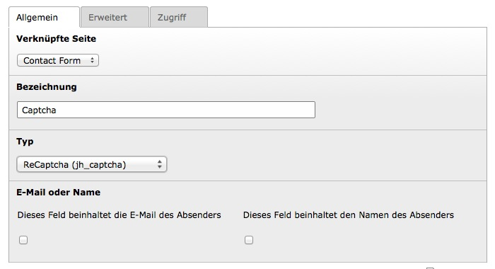
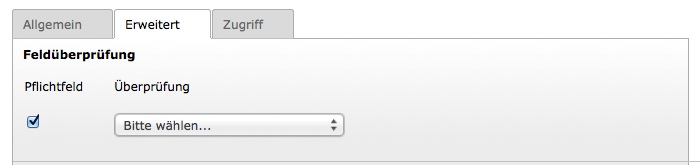

.. ==================================================
.. FOR YOUR INFORMATION
.. --------------------------------------------------
.. -*- coding: utf-8 -*- with BOM.

.. include:: ../../Includes.txt

.. _user-manual:

Benutzer Handbuch
=================

Erforderliche Konfiguration
^^^^^^^^^^^^^^^^^^^^^^^^^^^

1) Du musst deine Seite registrieren um ein API-Schlüsselpaar für reCAPTCHA zu erhalten: http://www.google.com/recaptcha/admin

2) Trage diese Schlüssel in TypoScript ein:

.. code-block:: typoscript
    :linenos:
    :emphasize-lines: 4, 5

    plugin.tx_jhcaptcha {
        settings {
            reCaptcha {
                siteKey =
                secretKey =
            }
        }
    }

Optionale Konfiguration
^^^^^^^^^^^^^^^^^^^^^^^

.. code-block:: typoscript
    :linenos:
    :emphasize-lines: 7, 11, 15

    plugin.tx_jhcaptcha {
        settings {
            reCaptcha {
                # Beschreibung: Farbe des Captchas
                # Optionen: dark | light
                # Standard: light
                theme = light
                # Beschreibung: Der Typ des Captchas
                # Optionen: audio | image
                # Standard: image
                type = image
                # Beschreibung: Die Sprache des Captchas
                # Optionen: https://developers.google.com/recaptcha/docs/language
                # Standard: en
                lang = en
            }
        }
    }

Verwendung in Powermail
^^^^^^^^^^^^^^^^^^^^^^^

Das ReCaptcha kann leicht in der `Erweiterung Powermail`_ verwendet werden.
Folgende Schritte sind dafür notwendig:

.. _Erweiterung Powermail: http://typo3.org/extensions/repository/view/powermail

.. important::

    Bitte beachte, dass die Verwendung nur in der Powermail Version 2.2.0 getestet wurde!

1. Seiten-TSconfig
------------------

Zuerst muss ein neues Feld in Powermail für das ReCaptcha erstellt werden.
Füge dazu folgende Zeile im Seiten-TSconfig ein.

.. code-block:: typoscript
    :linenos:

    tx_powermail.flexForm.type.addFieldOptions.jhcaptcharecaptcha = ReCaptcha (jh_captcha)

2. TypoScript
-------------

Nun muss Powermail noch mitgeteilt werden, wo das zugehörige Partial gefunden werden kann:

.. code-block:: typoscript
    :linenos:
    :emphasize-lines: 5

    plugin.tx_powermail.view {
        partialRootPath >
        partialRootPaths {
            10 = EXT:powermail/Resources/Private/Partials/
            20 = EXT:jh_captcha/Resources/Private/Powermail/Partials/Jhcaptcharecaptcha
        }
    }

3. Formular
-----------

Jetzt kannst du das ReCaptcha in deinem Formular verwenden.

1. Erstelle dazu in deinem Formular ein neues Feld, vergebe eine Bezeichnung (z.B. "Captcha") und wähle den Typ "ReCaptcha (jh_captcha)" aus.

2. Wechsel nun in den Reiter "Erweitert". Setze im Bereich "Feldüberprüfung" einen Haken bei "Pflichtfeld" und lasse das Feld "Überprüfung" leer.

Jetzt ist das ReCaptcha einsatzbereit!
