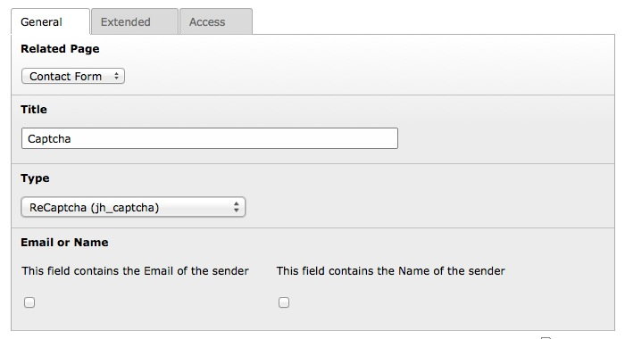
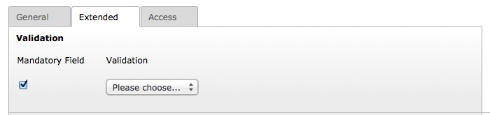

.. ==================================================
.. FOR YOUR INFORMATION
.. --------------------------------------------------
.. -*- coding: utf-8 -*- with BOM.

.. include:: ../Includes.txt

.. _user-manual:

Users Manual
============

Required Configuration
^^^^^^^^^^^^^^^^^^^^^^

1) To use reCAPTCHA, you need to sign up for an API key pair for your site: http://www.google.com/recaptcha/admin

2) Set your API key pair in TypoScript:

.. code-block:: typoscript
    :linenos:
    :emphasize-lines: 4, 5

    plugin.tx_jhcaptcha {
        settings {
            reCaptcha {
                siteKey =
                secretKey =
            }
        }
    }

Optional Configuration
^^^^^^^^^^^^^^^^^^^^^^

.. code-block:: typoscript
    :linenos:
    :emphasize-lines: 7, 11, 15

    plugin.tx_jhcaptcha {
        settings {
            reCaptcha {
                # Description: The color theme of the widget
                # Options: dark | light
                # Default: light
                theme = light
                # Description: The type of CAPTCHA to serve.
                # Options: audio | image
                # Default: image
                type = image
                # Description: The language of the widget
                # Options: https://developers.google.com/recaptcha/docs/language
                # Default: en
                lang = en
            }
        }
    }

Usage in powermail
^^^^^^^^^^^^^^^^^^

The reCAPTCHA can easy be used in the `extension powermail`_. The following steps are necessary:

.. _extension powermail: http://typo3.org/extensions/repository/view/powermail

.. note::

    Note that the usage has only been tested in the powermail versions 2.2.0-2.10.0!

1. Page-TSconfig
----------------

First, a new field in powermail must be created for the reCAPTCHA.
Add the following line to the PageTSconfig.

.. code-block:: typoscript
    :linenos:

    tx_powermail.flexForm.type.addFieldOptions.jhcaptcharecaptcha = reCAPTCHA (jh_captcha)

2. TypoScript
-------------

Take TypoScript Setup to tell powermail, where to find the partial:

.. code-block:: typoscript
    :linenos:
    :emphasize-lines: 5

    plugin.tx_powermail.view {
        partialRootPath >
        partialRootPaths {
            10 = EXT:powermail/Resources/Private/Partials/
            20 = EXT:jh_captcha/Resources/Private/Powermail/Partials/Jhcaptcharecaptcha
        }
    }

3. Form
-------

Now you can use it in your form.

1. Create a new field in your form, set a title ("Captcha" for example) and select the type "reCAPTCHA (jh_captcha)".

2. Go to the "Extended" tab. Check "Mandatory Field" and let the "Validation" field blank.

Now the reCAPTCHA is ready!

Usage in Formhandler
^^^^^^^^^^^^^^^^^^^^

The reCAPTCHA can easy be used in the `extension formhandler`_.
The following steps are necessary:

.. _extension formhandler: http://typo3.org/extensions/repository/view/formhandler

.. note::

    Note that the usage has only been tested in the formhandler versions 2.0.x!

1. Mastertemplate
-----------------

First the captcha needs to be included in the master template. Example:

.. code-block:: html
    :linenos:

    <!-- ###master_spamprotection-jh_captcha_recaptcha### -->
    

        

            <label class="###is_error_jh_captcha_recaptcha###">###LLL:jh_captcha_recaptcha### ###required_jh_captcha_recaptcha###</label>
        

        

            ###jh_captcha_recaptcha###
            ###error_jh_captcha_recaptcha###
        

    

    <!-- ###master_spamprotection-jh_captcha_recaptcha### -->

2. Template
-----------

Now the marker can be used in the Form Template:

.. code-block:: html
    :linenos:

    ###master_spamprotection-jh_captcha_recaptcha###

3. TypoScript
-------------

Then the validators need to be assigned to the captcha field:

.. code-block:: typoscript
    :linenos:

    [...]
    validators.1.config.fieldConf {
        jh_captcha_recaptcha.errorCheck {
            1 = required
            2 = Tx_JhCaptcha_ErrorCheck_ReCaptcha
        }
    }
    [...]

4. Sprachdatei
--------------

Finally, the label and the error messages must be defined. Example:

.. code-block:: xml
    :linenos:

    <label index="jh_captcha_recaptcha">reCAPTCHA</label>
    <label index="error_jh_captcha_recaptcha_required">reCAPTCHA ist ein Pflichtfeld.</label>
    <label index="error_jh_captcha_recaptcha_Tx_JhCaptcha_ErrorCheck_ReCaptcha">Fehler beim Validieren des reCAPTCHA.</label>

Now the reCAPTCHA is ready!
